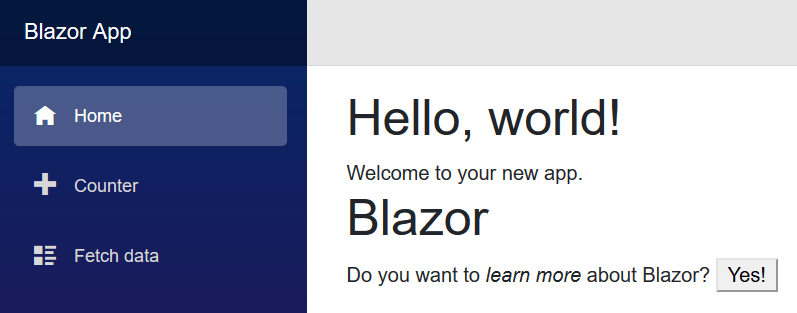
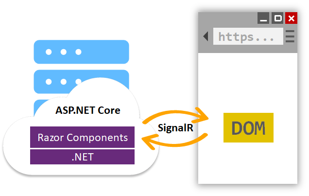

# Introduction to ASP.NET Core Blazor

By [Daniel Roth](https://github.com/danroth27) and [Luke Latham](https://github.com/guardrex)

*Welcome to Blazor!*

Blazor is a framework for building interactive client-side web UI with .NET:

* Create rich interactive UIs using C# instead of JavaScript.
* Share server-side and client-side app logic written in .NET.
* Render the UI as HTML and CSS for wide browser support, including mobile browsers.
* Integrate with modern hosting platforms, such as [Docker](/dotnet/standard/microservices-architecture/container-docker-introduction/index).

Using .NET for client-side web development offers the following advantages:

* Write code in C# instead of JavaScript.
* Leverage the existing .NET ecosystem of .NET libraries.
* Share app logic across server and client.
* Benefit from .NET's performance, reliability, and security.
* Stay productive with Visual Studio on Windows, Linux, and macOS.
* Build on a common set of languages, frameworks, and tools that are stable, feature-rich, and easy to use.

## Components

Blazor apps are based on *components*. A component in Blazor is an element of UI, such as a page, dialog, or data entry form.

Components are .NET classes built into .NET assemblies that:

* Define flexible UI rendering logic.
* Handle user events.
* Can be nested and reused.
* Can be shared and distributed as [Razor class libraries](xref:razor-pages/ui-class) or [NuGet packages](/nuget/what-is-nuget).

The component class is usually written in the form of a [Razor](xref:mvc/views/razor) markup page with a *.razor* file extension. Components in Blazor are formally referred to as *Razor components*. Razor is a syntax for combining HTML markup with C# code designed for developer productivity. Razor allows you to switch between HTML markup and C# in the same file with [IntelliSense](/visualstudio/ide/using-intellisense) support. Razor Pages and MVC also use Razor. Unlike Razor Pages and MVC, which are built around a request/response model, components are used specifically for client-side UI logic and composition.

The following Razor markup demonstrates a component (*Dialog.razor*), which can be nested within another component:

```razor
<div>
    <h1>@Title</h1>

    @ChildContent

    <button @onclick="OnYes">Yes!</button>
</div>

@code {
    [Parameter]
    public string Title { get; set; }

    [Parameter]
    public RenderFragment ChildContent { get; set; }

    private void OnYes()
    {
        Console.WriteLine("Write to the console in C#! 'Yes' button was selected.");
    }
}
```

The dialog's body content (`ChildContent`) and title (`Title`) are provided by the component that uses this component in its UI. `OnYes` is a C# method triggered by the button's `onclick` event.

Blazor uses natural HTML tags for UI composition. HTML elements specify components, and a tag's attributes pass values to a component's properties.

In the following example, the `Index` component uses the `Dialog` component. `ChildContent` and `Title` are set by the attributes and content of the `<Dialog>` element.

*Index.razor*:

```razor
@page "/"

<h1>Hello, world!</h1>

Welcome to your new app.

<Dialog Title="Blazor">
    Do you want to <i>learn more</i> about Blazor?
</Dialog>
```

The dialog is rendered when the parent (*Index.razor*) is accessed in a browser:



When this component is used in the app, IntelliSense in [Visual Studio](/visualstudio/ide/using-intellisense) and [Visual Studio Code](https://code.visualstudio.com/docs/editor/intellisense) speeds development with syntax and parameter completion.

Components render into an in-memory representation of the browser's Document Object Model (DOM) called a *render tree*, which is used to update the UI in a flexible and efficient way.

## Blazor WebAssembly

[!INCLUDE[](~/includes/blazorwasm-preview-notice.md)]

Blazor WebAssembly is a single-page app framework for building interactive client-side web apps with .NET. Blazor WebAssembly uses open web standards without plugins or code transpilation and works in all modern web browsers, including mobile browsers.

Running .NET code inside web browsers is made possible by [WebAssembly](https://webassembly.org) (abbreviated *wasm*). WebAssembly is a compact bytecode format optimized for fast download and maximum execution speed. WebAssembly is an open web standard and supported in web browsers without plugins.

WebAssembly code can access the full functionality of the browser via JavaScript, called *JavaScript interoperability* (or *JavaScript interop*). .NET code executed via WebAssembly in the browser runs in the browser's JavaScript sandbox with the protections that the sandbox provides against malicious actions on the client machine.


When a Blazor WebAssembly app is built and run in a browser:

* C# code files and Razor files are compiled into .NET assemblies.
* The assemblies and the .NET runtime are downloaded to the browser.
* Blazor WebAssembly bootstraps the .NET runtime and configures the runtime to load the assemblies for the app. The Blazor WebAssembly runtime uses JavaScript interop to handle DOM manipulation and browser API calls.

The size of the published app, its *payload size*, is a critical performance factor for an app's useability. A large app takes a relatively long time to download to a browser, which diminishes the user experience. Blazor WebAssembly optimizes payload size to reduce download times:

* Unused code is stripped out of the app when it's published by the [Intermediate Language (IL) Linker](xref:host-and-deploy/blazor/configure-linker).
* HTTP responses are compressed.
* The .NET runtime and assemblies are cached in the browser.

## Blazor Server

Blazor decouples component rendering logic from how UI updates are applied. Blazor Server provides support for hosting Razor components on the server in an ASP.NET Core app. UI updates are handled over a [SignalR](xref:signalr/introduction) connection.

The runtime handles sending UI events from the browser to the server and applies UI updates sent by the server back to the browser after running the components.

The connection used by Blazor Server to communicate with the browser is also used to handle JavaScript interop calls.



## JavaScript interop

For apps that require third-party JavaScript libraries and access to browser APIs, components interoperate with JavaScript. Components are capable of using any library or API that JavaScript is able to use. C# code can call into JavaScript code, and JavaScript code can call into C# code. For more information, see the following articles:

* <xref:blazor/call-javascript-from-dotnet>
* <xref:blazor/call-dotnet-from-javascript>

## Code sharing and .NET Standard

Blazor implements [.NET Standard 2.0](/dotnet/standard/net-standard). .NET Standard is a formal specification of .NET APIs that are common across .NET implementations. .NET Standard class libraries can be shared across different .NET platforms, such as Blazor, .NET Framework, .NET Core, Xamarin, Mono, and Unity.

APIs that aren't applicable inside of a web browser (for example, accessing the file system, opening a socket, and threading) throw a <xref:System.PlatformNotSupportedException>.

## Additional resources

* [WebAssembly](https://webassembly.org/)
* <xref:blazor/hosting-models>
* <xref:tutorials/signalr-blazor-webassembly>
* [C# Guide](/dotnet/csharp/)
* <xref:mvc/views/razor>
* [HTML](https://www.w3.org/html/)
* [Awesome Blazor](https://github.com/AdrienTorris/awesome-blazor) community links
